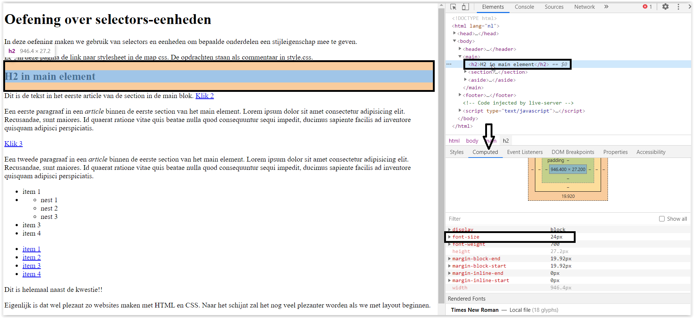
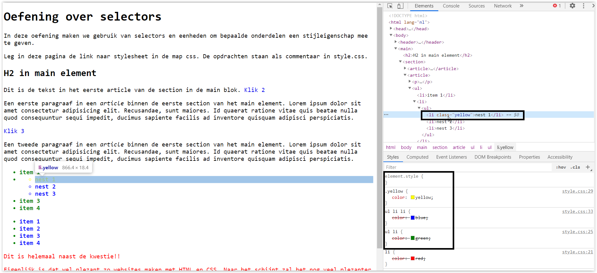
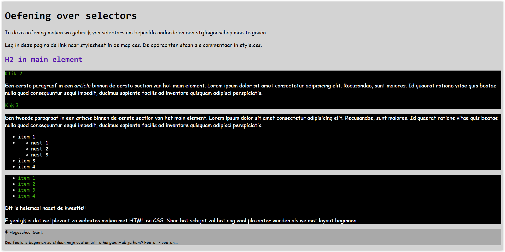
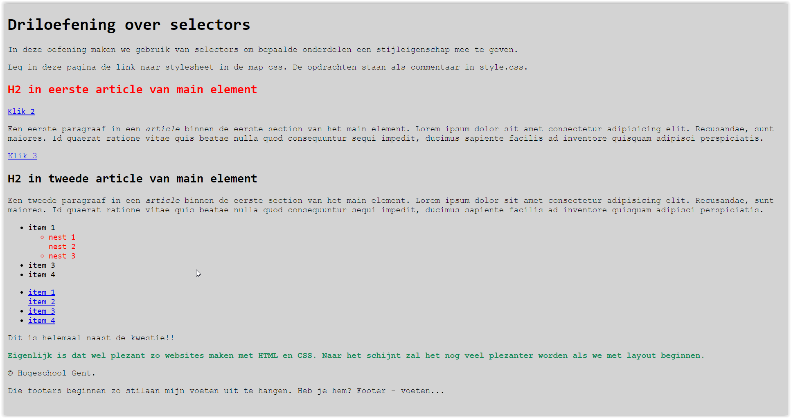
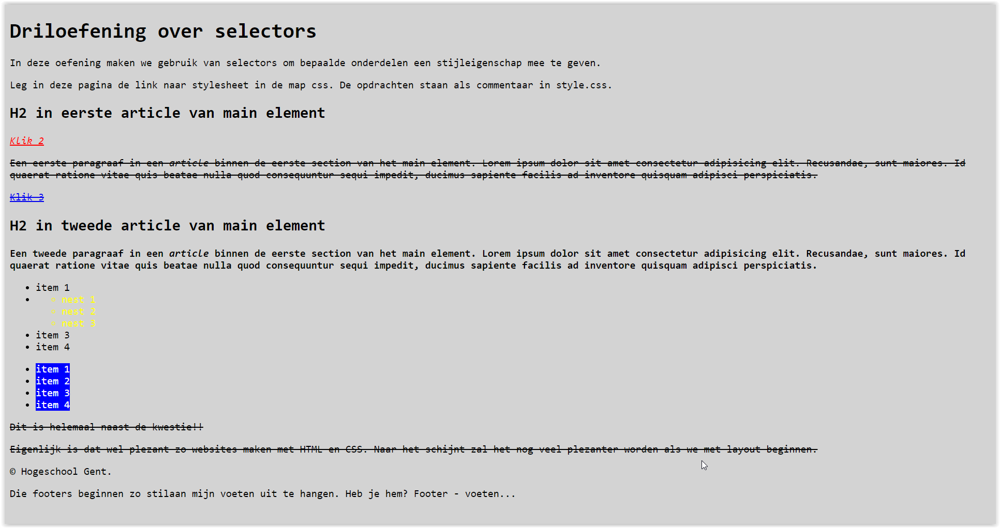
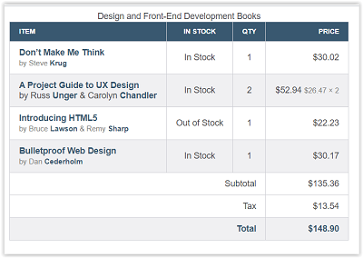
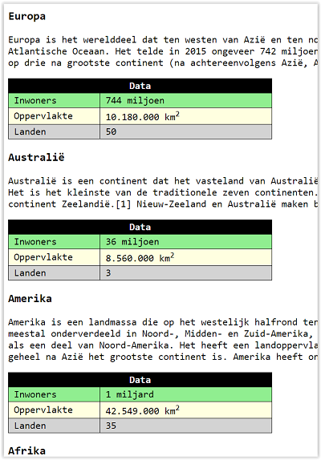

# Oefeningen les 6: Basis CSS

Deze oefeningen geven je de kans om de leerstof van Hoofdstuk 8 in het handboek in te oefenen.      
    - eenheden   
    - specificiteit     
    - cascading     
    - selectors            
            
Per oefening is er een map aangemaakt met daarin een **index.html** en een map **css** die het externe css bestand bevat **style.css**.     
De HTML mag niet gewijzigd te worden, tenzij expliciet anders vermeld.   
De opgave van de oefeningen staan meestal in het css bestand in de map CSS.      

-----

## Oefening 1: Eenheden.

Open de map oefening01.       
Leg in de *index.html* de link naar de externe stylesheet *style.css*.      
Beantwoord de vragen die in commentaar staan in style.css.     
Controleer je antwoord via de ontwikkelaarstools van chrome (F12).      
Hieronder zie je hoe je dit kan doen.    
Selecteer het element dat je wil checken. Klik op computed en check de font-size.     
       

-----

## Oefening 2: Specificiteit.

Open de map oefening02. De opgave staat in de *style.css*.           
Bepaal welke regel wordt toegepast voor de "nest1" en voor de items in de nav (zie index.html) in de aside sectie.     
Bepaal voor elke stijlregel de specificiteit.                      
Tip: ga met je cursor boven de selector en dan wordt de specificiteit getoond.            
Bekijk het resultaat in Chrome en bekijk de toegepaste regels in element.

          
        

-----

## Oefening 3: Typeselectors.

Open de map oefening03. De opgave staat in de *style.css*.      
Leg in de *index.html* de link naar de externe stylesheet *style.css*.          
Bepaal de juiste selector en stijlregel.    
Tip voor de juiste stijlregel: https://developer.mozilla.org/en-US/docs/Web/CSS/Reference#Keyword_index      
Nog een tip voor de keuze van de stijlregel: **gezond boerenverstand!!**

Eindresultaat.
          
        

-----
## Oefening 4: Class selectors.

Open de map oefening04. De opgave staat in de *style.css*.                
Voeg een gepast class attribuut toe aan de juiste elementen in index.html.     
Voeg vervolgens de juiste stijlregel(s) toe.    
Ook hier geldt:    
https://developer.mozilla.org/en-US/docs/Web/CSS/Reference#Keyword_index en gebruik je **gezond boerenverstand!!**

Eindresultaat.      
            

-----
## Oefening 5: Pseudoclasses.

Open de map oefening05. De opgave staat in de *style.css*.           
Het resultaat moet hetzelfde zijn als de vorige oefening maar 
nu zonder class attributen toe te voegen. Maak dus enkel gebruik van pseudoclass selectors.       

Eindresultaat: zie hierboven.
        

-----
## Oefening 6: Combinatieselectors: descendant - child - sibling selectors.

Open de map oefening06. De opgave staat in de *style.css*. 
Maak enkel gebruik van combinatieselectors (geen class selectors gebruiken) om onderstaand resultaat te krijgen:      
       

        

-----
## Oefening 7: Opmaak tabel.

Open de map oefening07. De opgave staat in de *style.css*. 
Maak gebruik van de juiste selectors (geen class selectors gebruiken) om onderstaand resultaat te krijgen.        
De gebruikte kleuren staan bovenaan vermeld in de *style.css*.     
Let op de uitlijning in de cellen (stijlregel: *text-align: value;*).            
       

-----
## Oefening 8: Opmaak tabellen.

Open de map oefening08.  
Maak gebruik van de juiste selectors (geen class selectors gebruiken) om onderstaand resultaat te krijgen voor alle tabellen.        
          

De gebruikte kleuren zijn:      
    - bovenste rij: tekst: wit en achtegrond: zwart                
    - tweede rij: lightgreen               
    - derde rij: lightyellow                  
    - vierde rij: lightgray                             
De eerste rij is minimaal 150 px breed en de tweede rij minimaal 300px breed (*min-width: value;*).      
  